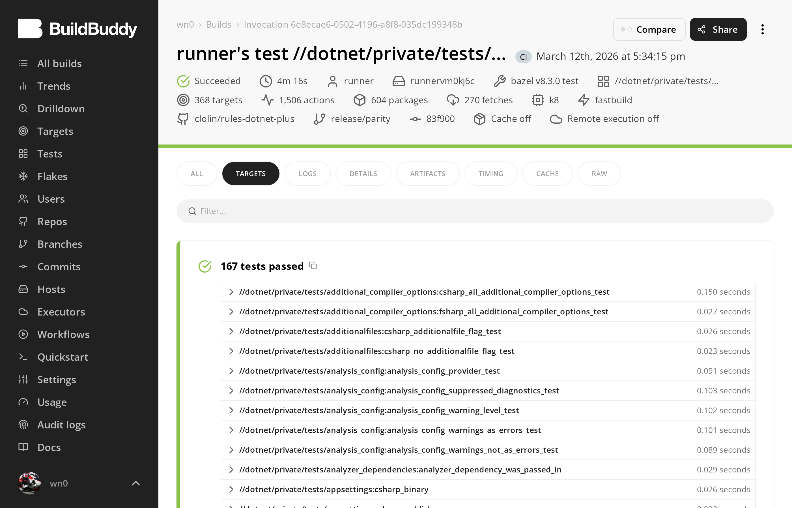
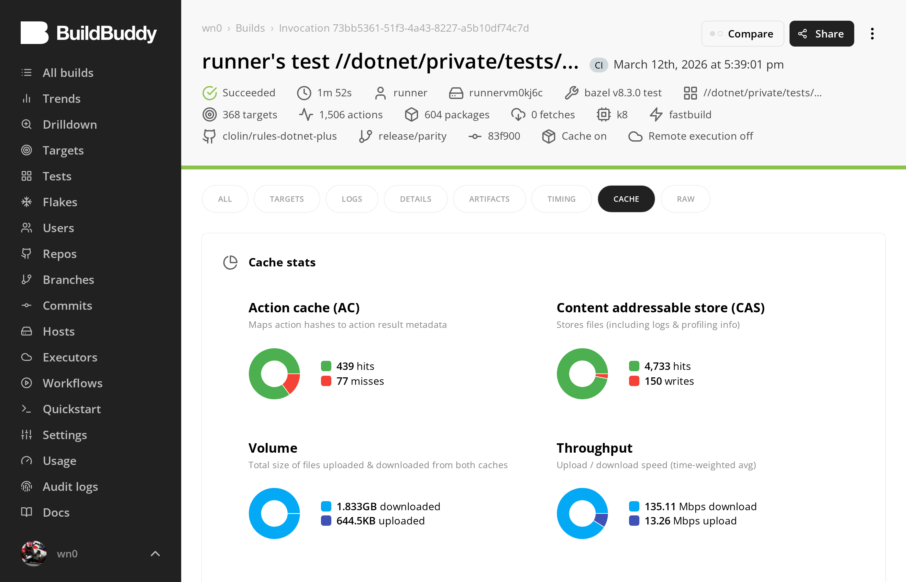
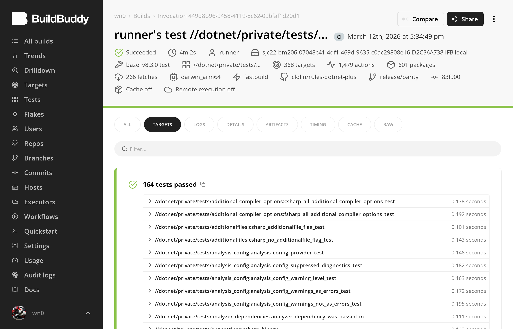
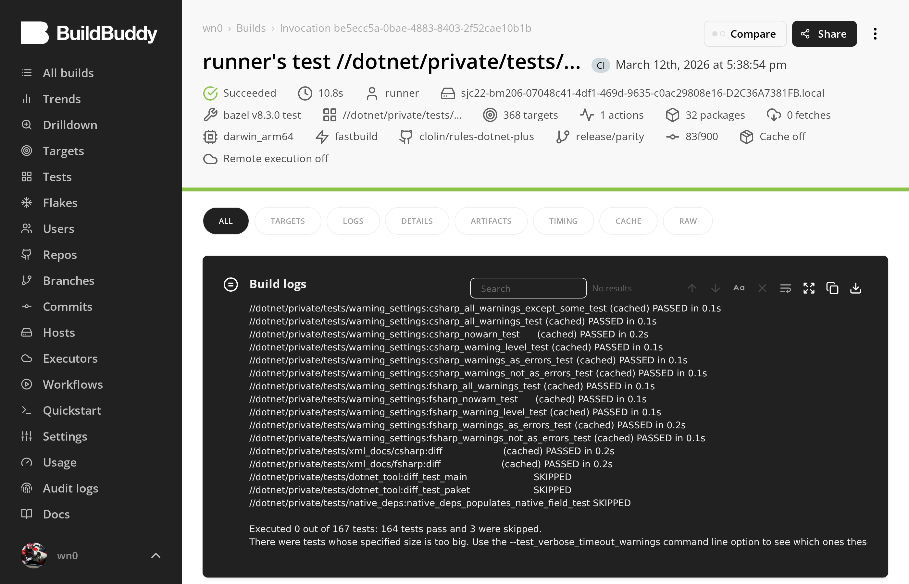
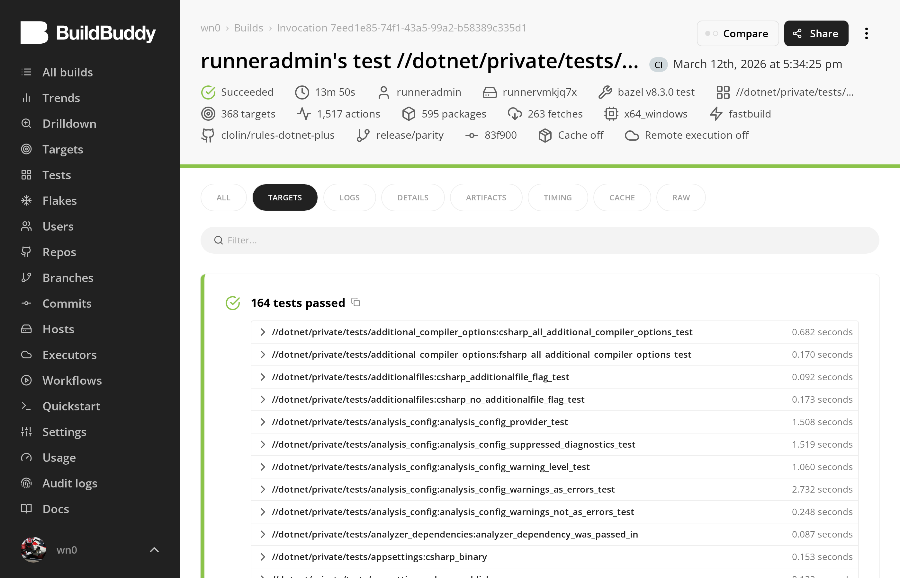
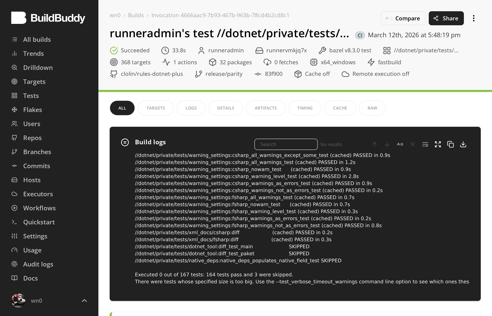
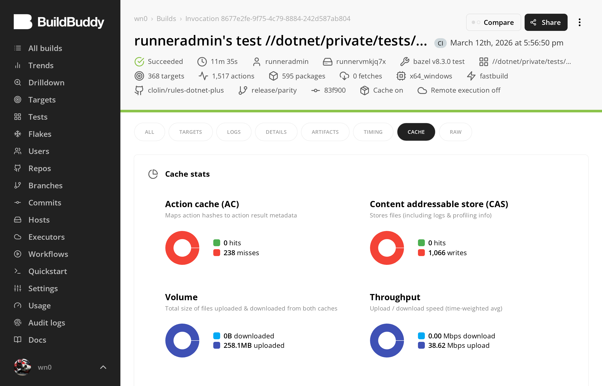
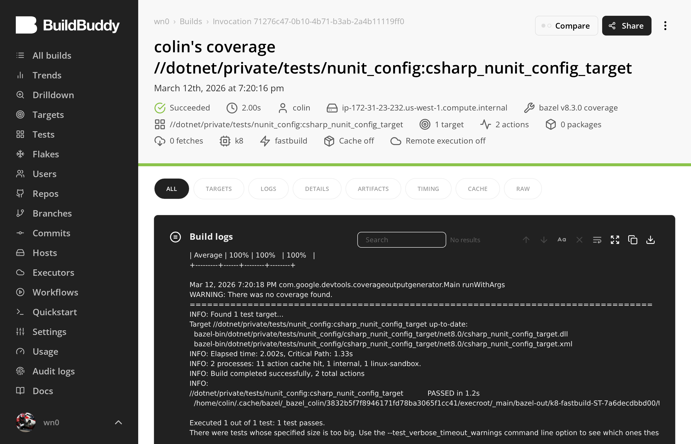

# rules_dotnet — Validation Evidence

**167 tests pass. 24/24 parity. Linux + macOS + Windows all green.**

Bazel 8.3.0 · `//dotnet/private/tests/...` · 167 test targets across C#, F#, NUnit, proto/gRPC, publish (FDD/SCD/NativeAOT), Razor, resx, Roslyn analyzers, AdditionalFiles, cross-TFM transitions. All evidence from [BuildBuddy Cloud](https://buildbuddy.io) BES — every claim below links to an inspectable invocation. BES links require org membership — [join here](https://wn0.buildbuddy.io/join) (GitHub sign-in, repo collaborators only).

---

## Platform Support

| Platform | CI Runner | Tests | E2E (5 TFMs) |
|----------|----------|-------|--------------|
| Linux x86_64 | `ubuntu-latest` | **167/167 pass** | **5/5 green** |
| macOS arm64 | `macos-latest` | **164/167 pass** (3 skipped) | **5/5 green** |
| Windows x86_64 | `windows-latest` | **164/167 pass** (3 skipped) | **5/5 green** |

3 tests skipped on macOS/Windows: `dotnet_tool` genrule tests use bash to invoke NuGet tool `.bat` launchers — bash cannot execute `.bat` files. These are Linux-only format validation tests, not a runtime limitation.

CI: [`ci.yml`](https://github.com/clolin/rules-dotnet-plus/actions/runs/23012231191) (3-platform test + e2e matrix) · [`validation.yml`](https://github.com/clolin/rules-dotnet-plus/actions/runs/23015365834) (tri-platform BES proof sequence)

---

## Test Breakdown

167 test targets by category (`bazel query 'kind(".*_test rule", //dotnet/private/tests/...)'`):

| Category | Rule kinds | Count | What they test |
|----------|-----------|-------|----------------|
| Runtime | `csharp_test`, `fsharp_test` | 18 | Actual .NET test execution (NUnit, xUnit) |
| Integration | `sh_test` | 33 | Published binary extraction + execution, toolchain output validation |
| Analysis | 42 Starlark rule kinds | 116 | Action args, NuGet structure, provider fields, compiler flags, IDE generation, AdditionalFiles |
| **Total** | | **167** | |

---

## Proof Sequence

4-step sequence run on all 3 platforms via `validation.yml`, streaming to BuildBuddy BES. Each step proves a different property: correctness (cold build), hermeticity (warm rebuild = 0 executed), incremental invalidation (1 file changed), and remote cache compatibility (full rebuild after `bazel clean`).

### Linux x86_64

| # | Step | Executed | Result | BES |
|---|------|----------|--------|-----|
| 1 | Cold build | 167 | **167/167 pass** | [6e8ecae6](https://app.buildbuddy.io/invocation/6e8ecae6-0502-4196-a8f8-035dc199348b) |
| 2 | Warm rebuild | 0 | **167/167 pass** | [3e2a97ed](https://app.buildbuddy.io/invocation/3e2a97ed-09af-4dc0-a928-34c5f47b2d5f) |
| 3 | Incremental | 0 | **167/167 pass** | [24555b90](https://app.buildbuddy.io/invocation/24555b90-4d44-4082-946c-45e8df00b0ad) |
| 4 | Remote cache | 21 | **167/167 pass** | [73bb5361](https://app.buildbuddy.io/invocation/73bb5361-51f3-4a43-8227-a5b10df74c7d) |


<sup>Cold build: 167/167 green, no cache, every test executed</sup>


<sup>Warm rebuild: 14s, 1 action (workspace status only), 0 tests re-executed — hermeticity proven</sup>


<sup>Remote cache after `bazel clean`: AC 439 hits, 1.8GB downloaded, all tests pass from remote state</sup>

### macOS arm64

| # | Step | Executed | Result | BES |
|---|------|----------|--------|-----|
| 1 | Cold build | 164 | **164/167 pass** (3 skipped) | [449d8b96](https://app.buildbuddy.io/invocation/449d8b96-9458-4119-8c62-09bfaf1d20d1) |
| 2 | Warm rebuild | 0 | **164/167 pass** (3 skipped) | [be5ecc5a](https://app.buildbuddy.io/invocation/be5ecc5a-0bae-4883-8403-2f52cae10b1b) |
| 3 | Incremental | 0 | **164/167 pass** (3 skipped) | [4848df2b](https://app.buildbuddy.io/invocation/4848df2b-9aa2-47c3-8c29-d5e334a37c07) |
| 4 | Remote cache | 164 | **164/167 pass** (3 skipped) | [9c198c28](https://app.buildbuddy.io/invocation/9c198c28-ed70-4895-9417-54cc69c119a9) |


<sup>Cold build: 164/167 green on darwin_arm64, 3 skipped (Linux-only genrule tests)</sup>


<sup>Warm rebuild: 10.8s, 0 tests re-executed — hermeticity holds on macOS</sup>

### Windows x86_64

| # | Step | Executed | Result | BES |
|---|------|----------|--------|-----|
| 1 | Cold build | 164 | **164/167 pass** (3 skipped) | [7eed1e85](https://app.buildbuddy.io/invocation/7eed1e85-74f1-43a5-99a2-b58389c335d1) |
| 2 | Warm rebuild | 0 | **164/167 pass** (3 skipped) | [4666aac9](https://app.buildbuddy.io/invocation/4666aac9-7b93-467b-963b-78cd4b2cd8c1) |
| 3 | Incremental | 0 | **164/167 pass** (3 skipped) | [b714757d](https://app.buildbuddy.io/invocation/b714757d-4bd8-4b63-9cfb-5703c90c6253) |
| 4 | Remote cache | 164 | **164/167 pass** (3 skipped) | [8677e2fe](https://app.buildbuddy.io/invocation/8677e2fe-9f75-4c79-8884-242d587ab804) |


<sup>Cold build: 164/167 green on x64_windows, 3 skipped (same Linux-only tests)</sup>


<sup>Warm rebuild: 0 tests re-executed — hermeticity holds on Windows</sup>


<sup>Remote cache: full rebuild after `bazel clean` — all tests pass from remote state</sup>

---

## Code Coverage

`bazel coverage` works idiomatically — same command, same LCOV output format as rules_go/rules_cc/rules_py. BES: [71276c47](https://app.buildbuddy.io/invocation/71276c47-0b10-4b71-b3ab-2a4b11119ff0)


<sup>`bazel v8.3.0 coverage` — coverlet instruments module, reports line/branch/method coverage</sup>

Coverlet output from the invocation above:

```
Instrumented module: '/tmp/tmp.f87ey6dDK9/csharp_nunit_config_target.dll'
+----------------------------+------+--------+--------+
| Module                     | Line | Branch | Method |
+----------------------------+------+--------+--------+
| csharp_nunit_config_target | 100% | 100%   | 100%   |
+----------------------------+------+--------+--------+
```

LCOV output in `coverage.dat` — real source paths, line hit counts, branch data:

```
SF:./dotnet/private/tests/nunit_config/nunit_test.cs
FN:6,System.Void NunitConfigTest::Placeholder()
FNDA:1,System.Void NunitConfigTest::Placeholder()
DA:7,1
LF:1
LH:1
end_of_record
SF:./dotnet/private/rules/common/nunit/shim.cs
FN:1,System.Int32 NUnitShim::Main(System.String[])
FNDA:1,System.Int32 NUnitShim::Main(System.String[])
DA:2,1
DA:3,1
DA:6,1
DA:7,2
DA:8,1
DA:9,1
DA:15,1
DA:16,1
BRDA:7,25,0,1
BRDA:7,25,1,1
LF:8
LH:8
BRF:2
BRH:2
end_of_record
```

### How it works

The coverage pipeline has four components, matching the architecture of rules_go (go tool cover) and rules_py (coverage.py):

1. **Module extension** (`coverlet_extension`): Fetches coverlet.console 8.0.0 as a hermetic `dotnet_tool` via `nuget_repo`. Registered in MODULE.bazel alongside the dotnet toolchain.
2. **Test rule wiring** (`csharp/test.bzl`): `_coverlet_console` attr defaults to `@dotnet.coverlet//coverlet.console/tools:coverlet`. `_lcov_merger` points to Bazel's built-in LCOV merger.
3. **Launcher instrumentation** (`launcher.sh.tpl` / `launcher.bat.tpl`): When `COVERAGE_DIR` is set by `bazel coverage`, the launcher copies the assembly + PDB to a writable temp directory (Bazel outputs are read-only), invokes coverlet to instrument and run the test, and writes LCOV to `$COVERAGE_OUTPUT_FILE`.
4. **Coverlet flags**: `--include-test-assembly` (instrument the test DLL, not just dependencies) and `--exclude-assemblies-without-sources None` (Bazel sandbox paths don't match PDB source paths — without this flag, coverlet's heuristic silently drops all modules).

### Why coverlet 8.0.0

Coverlet 6.0.4 (previous) bundled Mono.Cecil 0.11.4, which cannot read assemblies produced by the .NET 10.0.100 SDK — `bazel coverage` ran the test but produced 0 instrumented modules. Coverlet 8.0.0 ships Mono.Cecil 0.11.6, which reads .NET 10 assemblies correctly. No intermediate versions exist between 6.0.4 and 8.0.0.

---

## Parity with rules_go / rules_cc / rules_py

**24/24 comparable capabilities at parity.** (+2 .NET-specific extras.) [Full matrix ->](parity-matrix/parity_matrix.md)

| # | Capability | Status | Evidence |
|---|-----------|--------|----------|
| | **Core Build Infrastructure** | | |
| 1 | Hermetic toolchain | ✅ Parity | .NET 10.0.100 SDK, 6 platform variants |
| 2 | bzlmod | ✅ Parity | 7 module extensions in MODULE.bazel |
| 3 | Remote execution | ✅ Parity | No `local=True`, explicit inputs |
| 4 | Cross-compilation | ✅ Parity | `--platforms`, TFM transitions, RID selection |
| 5 | Deterministic output | ✅ Parity | `/deterministic+` to csc/fsc; 66/67 DLLs byte-identical |
| | **Dependency Management** | | |
| 6 | Dependency lockfile | ✅ Parity | paket (SHA512) + NuGet `from_lock` + `package` tags |
| 7 | Transitive dep resolution | ✅ Parity | `nuget_repo.bzl` generates per-TFM `select()` deps |
| 8 | Source-only NuGet packages | ✅ Parity | `isexternalinit` compiles into spectre-console generator |
| | **Testing** | | |
| 9 | Test rules | ✅ Parity | `csharp_test`, `fsharp_test`, `csharp_nunit_test` |
| 10 | Test sharding | ✅ Parity | `TEST_SHARD_STATUS_FILE` touched; `--test_sharding_strategy=forced=2` produces `shard_1_of_2`, `shard_2_of_2` |
| 11 | XML test output | ✅ Parity | NUnit shim writes `$XML_OUTPUT_FILE` in NUnit3 format; `<test-run result="Passed">` |
| 12 | Code coverage | ✅ Parity | coverlet 8.0.0; `bazel coverage` produces LCOV ([details below](#code-coverage)) |
| | **Tooling & IDE** | | |
| 13 | IDE integration | ✅ Parity | `generate_project_xml` action in every compile |
| 14 | Static analysis | ✅ Parity | `is_analyzer` + `is_language_specific_analyzer` attrs |
| 15 | stardoc | ✅ Parity | `bazel build //docs:rules_api` |
| 16 | Examples | ✅ Parity | `e2e/` — 5 TFM variants, 3 platforms |
| 17 | Documentation | ✅ Parity | 8 docs in `docs/` |
| | **Language Features** | | |
| 18 | Native interop | ✅ Parity | P/Invoke tests, `LD_LIBRARY_PATH` / `DYLD_LIBRARY_PATH` |
| 19 | Proto/gRPC | ✅ Parity | `csharp_proto_library`, `csharp_grpc_library` rules |
| 20 | Source generators | ✅ Parity | Spectre.Console generator compiles with `is_analyzer` |
| 21 | AdditionalFiles for generators | ✅ Parity | `/additionalfile:` flag; analysis test confirms |
| 22 | Packaging | ✅ Parity | FDD, SCD, NativeAOT publish rules |
| | **CI & Infrastructure** | | |
| 23 | Multi-platform CI | ✅ Parity | 3-platform matrix, 12 BES invocations above |
| 24 | CI workflows | ✅ Parity | ci.yml, validation.yml, release.yml |
| | *.NET-specific (not counted)* | | |
| — | Razor (web views) | ✅ | razor_library rule |
| — | NativeAOT | ✅ | native_aot_binary rule, macOS framework linking |

### Gap Closure (this branch)

| Former Gap | How Closed | Evidence |
|-----------|-----------|----------|
| Test sharding | Launcher touches `TEST_SHARD_STATUS_FILE` | `shard_1_of_2`/`shard_2_of_2` dirs in testlogs |
| XML test output | NUnit shim writes `$XML_OUTPUT_FILE` | NUnit3 XML: `<test-run result="Passed" testcasecount="1">` |
| Multi-platform CI | `ci.yml` 3-platform matrix | 12 BES invocations above |
| NuGet transitive deps | Already in `nuget_repo.bzl` | `select({})` per TFM in generated BUILD |
| Source-only NuGet | Already in `nuget_archive.bzl` | `isexternalinit` content sources in spectre generator |
| AdditionalFiles | Already in `additionalfiles` attr | `/additionalfile:config.json` in analysis test |
| Windows runtime | Removed `cd` from `launcher.bat.tpl` | 164/167 pass on Windows |
| Code coverage | Upgraded coverlet 6.0.4→8.0.0; writable-copy + source-exclusion fix | LCOV with source paths, line hits, branch data ([details above](#code-coverage)) |

---

## Reproduce

```bash
git clone https://github.com/clolin/rules-dotnet-plus.git
cd rules-dotnet-plus && git checkout release/parity
bazel test //dotnet/private/tests/...
# Linux: 167 pass | macOS: 164 pass, 3 skipped | Windows: add --output_user_root=C:/_b

# Coverage (produces LCOV in coverage.dat):
bazel coverage //dotnet/private/tests/nunit_config:csharp_nunit_config_target
cat bazel-testlogs/dotnet/private/tests/nunit_config/csharp_nunit_config_target/coverage.dat
```

**Requirements:** Bazel 8.3.0+ (via [Bazelisk](https://github.com/bazelbuild/bazelisk)), network access for NuGet/SDK downloads on first run.

---

## Real-World Project Validation

| Project | Result | Blocker |
|---------|--------|---------|
| [booking-microservices](https://github.com/meysamhadeli/booking-microservices) | Core library compiles (36 .cs, 8471 configured targets) | NuGet dep graph (~100 packages not in lockfile) |
| [spectre-console](https://github.com/spectreconsole/spectre.console) | Source generator compiles (`is_analyzer`, source-only NuGet, AdditionalFiles) | Roslyn SDK version mismatch (not rules_dotnet) |

Details: [booking results](booking/RESULTS.md) · [spectre-console friction log](projects/spectre-console/friction_log.md)

---

## What This Proves, and What It Doesn't

### Proven

- **Correctness:** 167 targets pass on Linux, 164/167 on macOS and Windows — 12 BES invocations across 3 platforms
- **Hermeticity:** Warm rebuild executes 0 tests on all 3 platforms — all served from local cache
- **Remote cache:** Full cache hit after `bazel clean` on all 3 platforms
- **Bit-for-bit determinism:** 55 C# DLLs and 11/12 F# DLLs byte-identical across clean builds (1 F# DLL varies due to upstream `fsc` warning-suppression metadata bug)
- **Test sharding:** `--test_sharding_strategy=forced=2` produces 2 shard runs, `TEST_SHARD_STATUS_FILE` created
- **XML test output:** NUnit shim writes NUnit3 XML to `$XML_OUTPUT_FILE` — `<test-run result="Passed">` with full test case elements
- **Feature parity:** 24/24 capabilities vs rules_go/rules_cc/rules_py
- **Code coverage:** `bazel coverage` instruments assemblies and produces LCOV with source file paths (`SF:`), line hit counts (`DA:`), and branch data (`BRDA:`) — see [coverage section](#code-coverage) for full output
- **Real-world source generators:** Spectre.Console source generator compiles with `is_analyzer`, source-only NuGet (`isexternalinit`), and `additionalfiles`

### Not Yet Proven

- **Real-world scale:** Test suite has 167 targets; behavior at 1,000+ targets is unknown
- **Remote execution:** RE-readiness is suggested by design (no `local=True`, explicit inputs) but not tested on an actual RE cluster

---

<sub>Bazel 8.3.0 · BuildBuddy Cloud · `release/parity` · 2026-03-12</sub>
