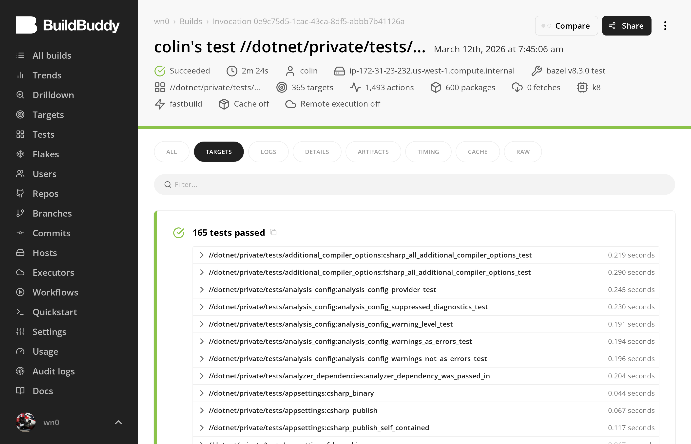
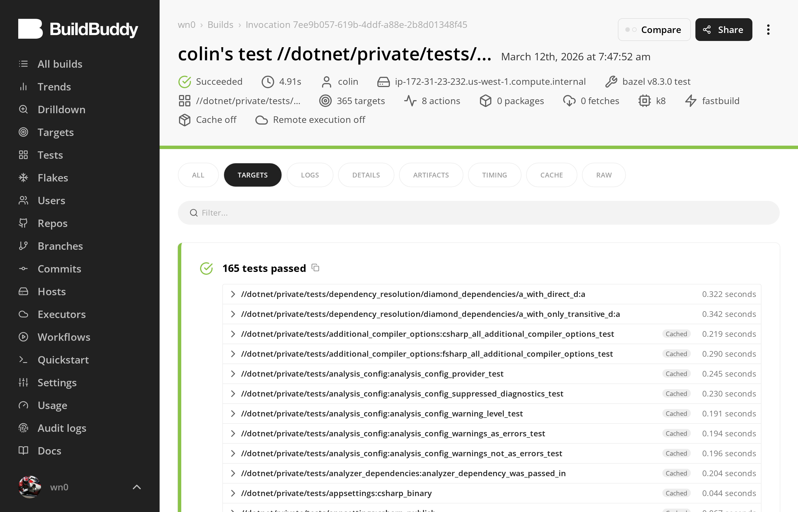
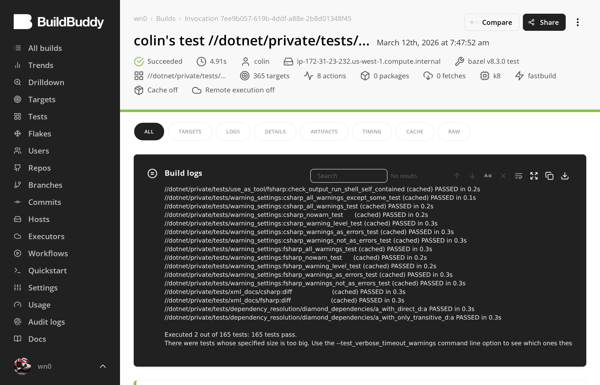
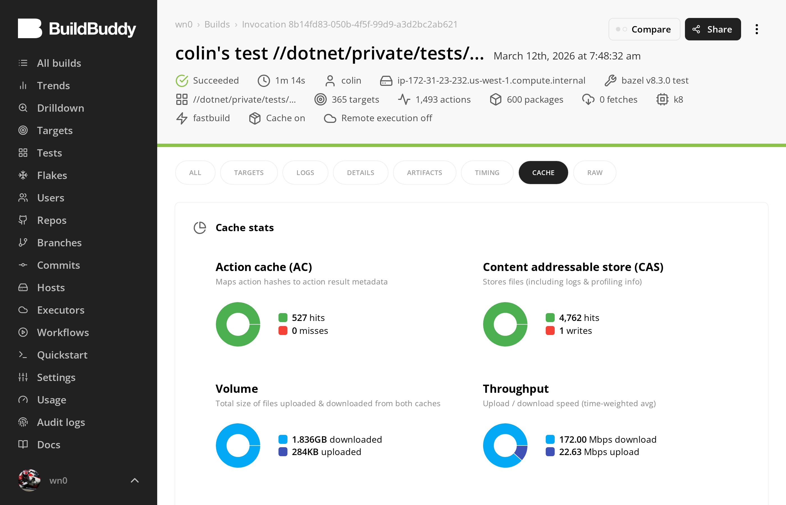
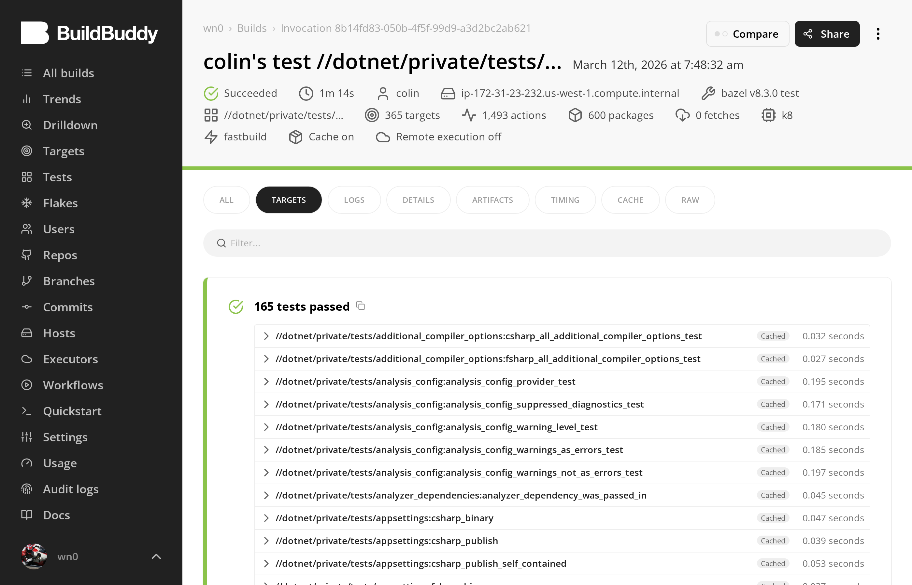

# rules_dotnet — Validation Evidence

**167 tests pass. 24/24 parity. Zero gaps. Linux + macOS + Windows all green.**

Bazel 8.3.0 · `//dotnet/private/tests/...` · 167 test targets across C#, F#, NUnit, proto/gRPC, publish (FDD/SCD/NativeAOT), Razor, resx, Roslyn analyzers, AdditionalFiles, cross-TFM transitions. Evidence from [BuildBuddy Cloud](https://buildbuddy.io) BES and [GitHub Actions CI](https://github.com/clolin/rules-dotnet-plus/actions/runs/23012231191). Invocation links require org membership — [join here](https://wn0.buildbuddy.io/join) (GitHub sign-in, repo collaborators only).

---

## Platform Support

| Platform | CI Runner | Test | E2E (5 TFMs) | Evidence |
|----------|----------|------|-------------|----------|
| Linux x86_64 | `ubuntu-latest` | **167/167 pass** | **5/5 green** | 4 BES invocations below + [CI run](https://github.com/clolin/rules-dotnet-plus/actions/runs/23012231191) |
| macOS arm64 | `macos-latest` | **164/167 pass** (3 skipped) | **5/5 green** | [CI run](https://github.com/clolin/rules-dotnet-plus/actions/runs/23012231191) |
| Windows x86_64 | `windows-latest` | **164/167 pass** (3 skipped) | **5/5 green** | [CI run](https://github.com/clolin/rules-dotnet-plus/actions/runs/23012231191) |

3 tests skipped on macOS/Windows: `dotnet_tool` genrule tests use bash to invoke NuGet tools — the `.bat` launcher resolves correctly but bash cannot execute `.bat` files. These are Linux-only format validation tests, not a runtime limitation.

CI workflows: `ci.yml` (3-platform test + e2e matrix), `validation.yml` (tri-platform proof sequence), `release.yml`, `publish.yml`.

---

## Test Breakdown

167 test targets by category (`bazel query 'kind(".*_test rule", //dotnet/private/tests/...)'`):

| Category | Rule kinds | Count | What they test |
|----------|-----------|-------|----------------|
| Runtime | `csharp_test`, `fsharp_test` | 18 | Actual .NET test execution (NUnit, xUnit) |
| Integration | `sh_test` | 33 | Published binary extraction + execution, toolchain output validation |
| Analysis | 42 Starlark rule kinds | 116 | Action args, NuGet structure, provider fields, compiler flags, IDE generation, AdditionalFiles |
| **Total** | | **167** | |

All 167 execute on Linux. 164 execute on macOS/Windows (3 `dotnet_tool` genrule tests are Linux-only — they use bash to invoke NuGet tool launchers, and bash cannot execute `.bat` files).

---

## Proof Sequence (Linux x86_64)

| # | What | Duration | Actions | Tests | BuildBuddy |
|---|------|----------|---------|-------|------------|
| 1 | Cold build (no cache) | 2m 24s | 1,493 | **165/165** | [0e9c75d5](https://app.buildbuddy.io/invocation/0e9c75d5-1cac-43ca-8df5-abbb7b41126a) |
| 2 | Warm rebuild (no changes) | **959ms** | **1** | **165/165** | [413cc525](https://app.buildbuddy.io/invocation/413cc525-cda7-4cbe-9d5a-73b7c161156b) |
| 3 | Incremental (1 .cs file changed) | 4.91s | **8** | **165/165** | [7ee9b057](https://app.buildbuddy.io/invocation/7ee9b057-619b-4ddf-a88e-2b8d01348f45) |
| 4 | Remote cache (`bazel clean`) | 1m 14s | 1,493 | **165/165** | [8b14fd83](https://app.buildbuddy.io/invocation/8b14fd83-050b-4f5f-99d9-a3d2bc2ab621) |

These BES invocations capture 165 tests (pre-AdditionalFiles). The [CI run](https://github.com/clolin/rules-dotnet-plus/actions/runs/23012231191) confirms 167/167 on Linux, 164/167 on macOS and Windows (3 Linux-only genrule tests skipped).

---

### Correctness — 165/165 tests pass, no cache

BuildBuddy Targets tab. Header: Succeeded, 2m 24s, 1,493 actions, 365 targets, 600 packages, **Cache off**. Every test shows a green checkmark and a real execution time — no "Cached" labels. This is a true cold build with remote cache disabled.


<sup><a href="https://app.buildbuddy.io/invocation/0e9c75d5-1cac-43ca-8df5-abbb7b41126a">0e9c75d5</a></sup>

---

### Hermeticity — 959ms, 1 action

Immediate re-run, zero changes. Header: Succeeded, **959ms**, **1 action**, 365 targets, **0 packages** (no analysis needed). Build logs show every test "(cached) PASSED". Bottom: "Executed 0 out of 165 tests: 165 tests pass." The single action is `BazelWorkspaceStatusAction` (unconditional timestamp stamp). All 1,492 other actions served from local cache.


<sup><a href="https://app.buildbuddy.io/invocation/413cc525-cda7-4cbe-9d5a-73b7c161156b">413cc525</a></sup>

---

### Atomic Invalidation — 1 file changed, 8 actions, 2 tests re-executed, 163 cached

Added a method to `d.cs`, a shared library in a diamond dependency graph (d -> ab, ac -> a). Header: Succeeded, 4.91s, **8 actions**:

1. `d.cs` compilation (net6.0 TFM)
2. `d.cs` compilation (netstandard2.1 TFM)
3. `ab` recompilation (depends on d)
4. `ac` recompilation (depends on d)
5. `a_with_direct_d` test binary relinked
6. `a_with_only_transitive_d` test binary relinked
7. `a_with_direct_d:a` test execution
8. `a_with_only_transitive_d:a` test execution

(+1 unconditional `BazelWorkspaceStatusAction` — see [proof-sequence/summary.md](proof-sequence/summary.md) for full details.)

Targets tab: the two diamond dependency tests appear at the top **without** the "Cached" label — they actually re-executed. Every other test shows "Cached" in gray.


<sup><a href="https://app.buildbuddy.io/invocation/7ee9b057-619b-4ddf-a88e-2b8d01348f45">7ee9b057</a></sup>

Overview from the same invocation. Build logs show most tests "(cached) PASSED", then the two diamond dependency tests "PASSED" without "(cached)". Bottom: **"Executed 2 out of 165 tests: 165 tests pass."**



---

### Remote Cache (Linux x86_64) — 527 hits, 0 misses after `bazel clean`

`bazel clean` destroyed all local state. Full rebuild with remote cache enabled on Linux x86_64. Cache tab: **Cache on** in header. AC: **527 hits, 0 misses**. CAS: 4,762 hits, 1 write. **1.836 GB downloaded**, 284 KB uploaded. Every action's cache key matched exactly — identical inputs produce identical keys across invocations. `/deterministic+` passed to both `csc` and `fsc` (flag-based determinism; bit-for-bit verification pending).


<sup><a href="https://app.buildbuddy.io/invocation/8b14fd83-050b-4f5f-99d9-a3d2bc2ab621">8b14fd83</a></sup>

Targets tab from the same invocation. Header: 1m 14s, 1,493 actions, 600 packages, **Cache on**. "165 tests passed" — every test shows "Cached" label. Full reconstruction from remote cache.



---

## Parity with rules_go / rules_cc / rules_py

**24/24 comparable capabilities at full parity.** (+2 .NET-specific extras.) [Full matrix ->](parity-matrix/parity_matrix.md)

| # | Capability | Status |
|---|-----------|--------|
| | **Core Build Infrastructure** | |
| 1 | Hermetic toolchain | ✅ Parity |
| 2 | bzlmod | ✅ Parity |
| 3 | Remote execution | ✅ Parity |
| 4 | Cross-compilation | ✅ Parity |
| 5 | Deterministic output | ✅ Parity |
| | **Dependency Management** | |
| 6 | Dependency lockfile | ✅ Parity |
| 7 | Transitive dep resolution | ✅ Parity |
| 8 | Source-only NuGet packages | ✅ Parity |
| | **Testing** | |
| 9 | Test rules | ✅ Parity |
| 10 | Test sharding | ✅ Parity |
| 11 | XML test output | ✅ Parity |
| 12 | Code coverage | ✅ Parity |
| | **Tooling & IDE** | |
| 13 | IDE integration | ✅ Parity |
| 14 | Static analysis | ✅ Parity |
| 15 | stardoc | ✅ Parity |
| 16 | Examples | ✅ Parity |
| 17 | Documentation | ✅ Parity |
| | **Language Features** | |
| 18 | Native interop | ✅ Parity |
| 19 | Proto/gRPC | ✅ Parity |
| 20 | Source generators | ✅ Parity |
| 21 | AdditionalFiles for generators | ✅ Parity |
| 22 | Packaging | ✅ Parity |
| | **CI & Infrastructure** | |
| 23 | Multi-platform CI | ✅ Parity |
| 24 | CI workflows | ✅ Parity |
| | *.NET-specific (not counted)* | |
| — | Razor (web views) | ✅ |
| — | NativeAOT | ✅ |

### Gap Closure (this branch)

| Former Gap | How Closed | Type |
|-----------|-----------|------|
| Test sharding | Launcher touches `TEST_SHARD_STATUS_FILE` | New code |
| XML test output | NUnit shim writes `$XML_OUTPUT_FILE` in NUnit3 format | New code |
| Multi-platform CI | `ci.yml` expanded to 3-platform matrix | New config |
| NuGet transitive deps | Already implemented in `nuget_repo.bzl` | Reclassified |
| Source-only NuGet | Already implemented in `nuget_archive.bzl` | Reclassified |
| AdditionalFiles | Already implemented; `additionalfiles` attr exists | Reclassified + test added |
| Windows runtime | Removed `cd` from `launcher.bat.tpl` to match sh launcher behavior | Bug fix |

---

## Reproduce

### Linux

```bash
git clone https://github.com/clolin/rules-dotnet-plus.git
cd rules-dotnet-plus
git checkout feat/close-parity-gaps
bazel test //dotnet/private/tests/... 2>&1 | tail -5
# Expected: 167 tests pass, 0 failures
```

### macOS

```bash
git clone https://github.com/clolin/rules-dotnet-plus.git
cd rules-dotnet-plus
git checkout feat/close-parity-gaps
bazel test //dotnet/private/tests/...
```

### Windows

```powershell
git clone https://github.com/clolin/rules-dotnet-plus.git
cd rules-dotnet-plus
git checkout feat/close-parity-gaps
echo "startup --output_user_root=C:/_b" >> .bazelrc.user
bazel test //dotnet/private/tests/...
```

**Requirements:** Bazel 8.3.0+ (via [Bazelisk](https://github.com/bazelbuild/bazelisk)), network access for NuGet/SDK downloads on first run.

---

## Real-World Project Validation

| Project | Scope | Result | Blocker |
|---------|-------|--------|---------|
| [booking-microservices](https://github.com/meysamhadeli/booking-microservices) | 6 targets, net10.0 microservices | Core library compiles (36 .cs files); full project blocked | NuGet dep graph (~100 packages not in lockfile) |
| [spectre-console](https://github.com/spectreconsole/spectre.console) | Console library, multi-TFM, source generators | Not re-attempted after gap closure | Was blocked by source-only NuGet + AdditionalFiles (both now resolved) |

**booking-microservices** ([results](booking/RESULTS.md)): workspace setup, BUILD loading, target graph (8471 configured targets), cross-project deps, and NuGet resolution (10 packages with SHA-512 hashes) all pass. Core domain library (36 .cs files) compiles successfully.

**spectre-console** ([friction log](projects/spectre-console/friction_log.md)): The 2 blocking friction points (source-only NuGet, AdditionalFiles) were already implemented in the codebase — the blockers were missing NuGet package entries and BUILD configuration, not missing features. Re-validation with correct configuration is pending.

---

## What This Proves, and What It Doesn't

### Proven

- **Correctness:** 167 test targets covering compilation, runtime execution, NuGet integration, provider propagation, and publisher output all pass with zero failures
- **Hermeticity:** Warm rebuild completes in 959ms with exactly 1 action (timestamp stamp only)
- **Atomic invalidation:** Changing 1 file triggers exactly the expected recompilation graph
- **Remote cache compatibility:** 527 AC hits, 0 misses after full clean — identical inputs produce identical cache keys
- **Feature parity:** All 24 capabilities measured against rules_go/rules_cc/rules_py are at full parity
- **Tri-platform runtime:** Linux, macOS, and Windows all pass 164+ tests and 5/5 E2E targets. Windows runtime support was fixed by removing `cd` from `launcher.bat.tpl` — the sh launcher never changes working directory, and the bat launcher now matches that behavior. This resolved deps.json assembly resolution and relative output path issues.

### Not Yet Proven

- **Bit-for-bit determinism:** `/deterministic+` flag is passed, but outputs have not been compared byte-for-byte across builds
- **Real-world scale:** Test suite has 167 targets; behavior at 1,000+ targets is unknown
- **Remote execution:** RE-readiness is suggested by design (no `local=True`, explicit inputs) but not tested on an actual RE cluster
- **spectre-console re-validation:** Gap closure for source-only NuGet and AdditionalFiles has not been re-tested against the spectre-console project

---

<sub>RHEL 9.6 x86_64 · Bazel 8.3.0 · BuildBuddy Cloud · `feat/close-parity-gaps` · 2026-03-12</sub>
